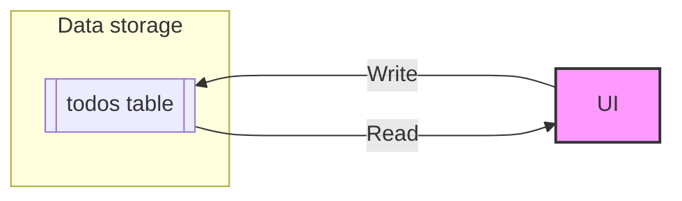
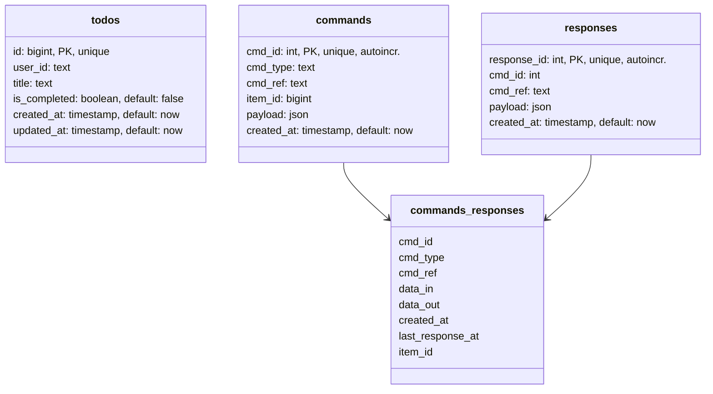
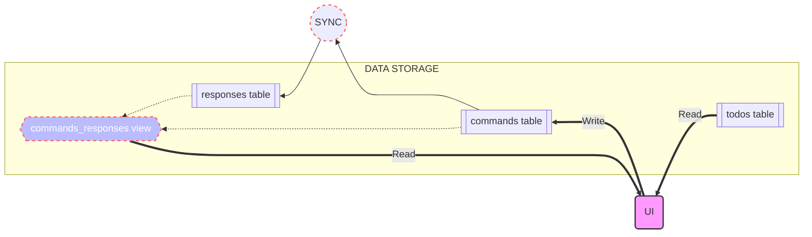
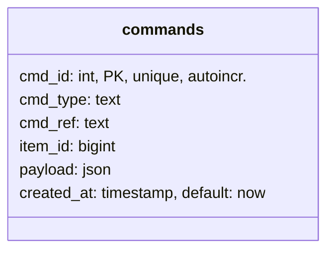
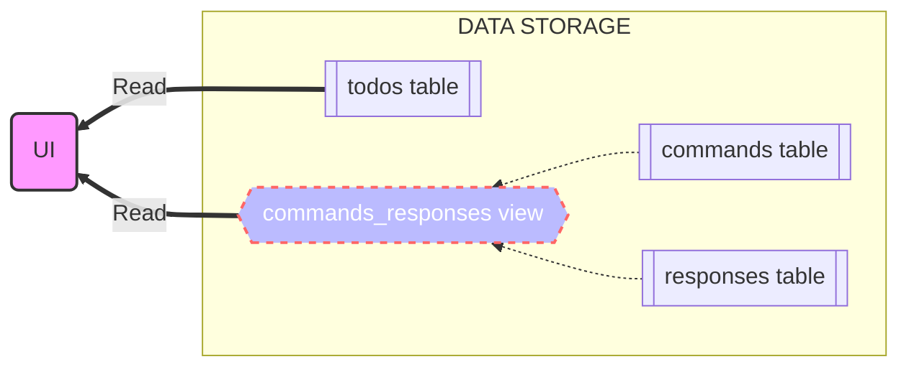

# Workshop: CQRS with hasura

- [What is CQRS](#what-is-cqrs)
	- [Advantages of CQRS](#advantages-of-cqrs)
	- [When to use it](#when-to-use-it)
	- [Challenges and disadvantages](#challenges-and-disadvantages)
	- [References](#references)
- [0. The todo list (master)](#0-the-todo-list-master)
- [1. Preparing the DB for CQRS](#1-preparing-the-db-for-cqrs)
- [2. Modifying a todo](#2-modifying-a-todo)
- [3. Reading from the CQRS ready database](#3-reading-from-the-cqrs-ready-database)
- [4. Displaying the new results](#4-displaying-the-new-results)
- [5. Setting up a sync service](#5-setting-up-a-sync-service)
- [6. Deleting a todo](#6-deleting-a-todo)
- [7. Creating a todo](#7-creating-a-todo)
- [8. Managing errors](#8-managing-errors)
- [9. Further development](#9-further-development)


### What is CQRS

The Command and Query Responsibility Segregation (CQRS) is an architectural pattern where the main focus is to separate the way of writing and reading data. This pattern uses two separate models:

* **Commands** — Which are responsible for update data
* **Queries** — Which are responsible for reading data

The image below illustrates an example implementation of the CQRS Pattern. 


Let's address the sync part between storages in a later stage. For now, let's just notice how in this solution, the write and read data storages are in separate Databases. This is a design choice, an alternative solution would be to separate the responsibilities in tables within the same database. 


### Advantages of CQRS
* **Separation of concerns** — When the read and write sides are separate, the models become more maintainable and flexible. The read model is typically simpler, while the write model involves more complex business logic.
* **Independent scaling** — With CQRS, read and write workloads can scale independently, resulting in fewer lock contentions.
* **Optimized data schemas** — On the read side, a schema can be optimized for queries, and on the write side, a schema can be optimized for updates.
* **Security** — It’s easier to ensure that only the right domain entities are performing writes on the data.
* **Simpler queries** — Application queries can avoid complex joins by storing a materialized view in the read database.
### When to use it
In a typical data management system, all CRUD (Create Read Update Delete) operations are executed on the same interface of the entities in a single data storage. Like creating, updating, querying and deleting table rows in an SQL database via the same model.

CQRS really shines compared to the traditional approach (using a single model) when you build complex data models to validate and fulfil your business logic when data manipulation happens. Read operations compared to update and write operations can be very different or much simpler – like accessing a subset of your data only.

### Challenges and disadvantages
Generally, the CQRS pattern will increase the complexity of the code. This Pattern is not suitable for all systems, and some considerations need to be done before applying this solution.

The main challenges in applying the CQRS pattern are: 
* Increase the complexity of the code.
* If using messaging to process commands and publish update events, the application must handle message failures or duplicate messages.
* If you separate the read and write databases, the read database may be stale, and it can be difficult to detect when a user has issued a request based on stale read data. 
* Sync: even if you use event-sourcing or some other mechanism to keep the databases sync, there will be some time delay (even if it’s a small one) before the writing database be consistent. So you should consider that maybe you can be reading data that is stale.


#### References

[Event store: The CQRS Pattern](https://www.eventstore.com/cqrs-pattern)

[Rising stack: CQRS explained](https://blog.risingstack.com/cqrs-explained-node-js-at-scale/)

[Better programming: CQRS Software Architecture Pattern](https://betterprogramming.pub/cqrs-software-architecture-pattern-the-good-the-bad-and-the-ugly-e9d6e7a34daf)

________________________

## 0. The todo list (master)

This is the starting point of our small application: a todo list.
The code in this branch contains a setup for a traditional UI implementing a list and a form.

In this code, we read and write from the same table in the DB: the todos table.



#### How to run

This project runs in Docker, uses Hasura for the grapQl queries, and Postgres as DB. You should already have Docker up and running. 

Makefile is used to facilitate CLI operations. Some commands will refer to the Hasura-CLI, this should be installed at first run.

##### First time only
1. npm install --save-dev hasura-cli
2. make install-client

##### Running the project
1. make start-all: run the project and the UI
2. make db: creates empty tables in the DB
3. make reset: resets to an empty DB

The UI will be available at (http://localhost:3000)

Hasura be available at (http://localhost:8080)

Adminer will be available at (http://localhost:8008)

*NOTE: Explore the make file for other useful commands*
________________________
## 1. Preparing the DB for CQRS

Now that we know what is the principle behind the CQRS pattern, we can start making some changes to our DB.

In our example we will use one single DB, but we will create 2 more tables ( and a view ) to support the separation of reading and writing responsibility. 

At the end of this process, our database will look like this:



We will **write into the commands table**, and **read from the commands_responses view**. The commands_responses view is generated and updated automatically in Postgres every time we insert a new command or response.

Our CQRS pattern can then be displayed in the following way: 



If you now reset your database and run *make db*, you will be able to see the new structure as described in the above schema.


 
##### *Note about syncing data*
*The process responsible to sync the reading and writing data storages is outside of the scope of this workshop, and it should be completely transparent to the client. We will however implement a small backend service that will simulate the sync between the reading and writing storages.*
________________________

## 2. Modifying a todo

We will write commands by communicating intentions to our DB, those intentions will then be picked by a service and transformed into actual data. 
There are some basic info that we will need to provide to our command. At the very least, we need to tell our DB who we are, what do we want to do, and how. Since an authentication service will be most probably already in place in our system, let's concentrate on the **what**, and the **how** 

Let's have a look again at our commands table: 



The **cmd_type** field will contain the what, here we explicitly tell our service **what we want to do**. In this specific case we want to update a todo item. A good choice for our command type name will therefore be: **todo_update**

Now, we know that we want to update a todo, but we still didn't specify how we want to update it. In our case we just want to modify the title of the todo item, the **payload** field is where we will store the **how** of our intention, and can easily look like this:

> {"id:" "123", "title": "The updated title"}

The other fields will be updated from within our code, and do not need our attention for now.

So, in plain english we are saying:

> *I want to update todo with id 123 by modifying the title to 'The updated title'*.

The corresponding mutation can be written like this: 

    mutation insertCommand{
		insert_commands(objects:[{
			  cmd_type: "todo_update",
			  item_id: 123,
			  payload: {id: "123", title: "The updated title"},
			  cmd_ref: "userID"
			}]) {
			affected_rows
			returning {
			  cmd_id
			  payload
			}
		}
	}

[Read more about mutations here](https://hasura.io/learn/graphql/intro-graphql/graphql-mutations/)

At this point, our code is still writing in the todos table, let's modify the code and write an intention in the commands table instead:
> #### TASK
> 1. Make a new function to add a command, and call that function when modifing a todo.
> 2. Modify the title of the todo.

You can now try this yourself from the UI. Update the todo item and inspect the hasura console to see the status of the DB after the command is placed.

No changes are now reflected in the UI after our update. So, what did just happen? Let's look table by table what we just did.
#### The todos table
Well, no difference here, we are indeed not even touching this table, we are now writing commands, not items.

#### The commands table
Here we can see the result of our mutation. A new row is saved and ready to be processed.

|cmd_id|cmd_type|item_id|cmd_ref|payload|created_at|
|--|--|--|--|--|--|
| 5 | todo_update | 123 | Gianni | {"id":"123", "title": "The updated title"} | 2022-06-17T13:24:13.238865+00:00 |


#### The commands_responses view
As displayed in a previous diagram, this will be our "reading table". A view allows us to simplify operations at the client, by receiving only the set of data needed to display required information.
This view will be populated as soon as there's some data changes either in our commands or in our responses table.
We can see now a new row, containing a command with no response.

|cmd_id|cmd_type|cmd_ref|data_in|data_out|created_at|last_response_at|item_id|
|--|--|--|--|--|--|--|--|
| 5 | todo_update | Gianni | {"id": "123","title": "The updated title"} | NULL | 2022-06-17T13:24:13.238865+00:00 | NULL | 123

#### The responses table
Our sync service (explained later) will populate this table when a command is received. For now, this table is still empty.

________________________

## 3. Reading from the CQRS ready database
We should now think how to fetch and display data from our UI. In a traditional setup we read from the todos table only, but since we updated our insert function, we can see that that method does not work anymore.

So, how should we proceed? If we look again at our schema, we can see that in our setup we will read both from the todos table, and the commands_responses view:




Let's change our fetchTodos function to receive data from both the todos table, and the commands_responses view. Our function will be named **fetchList**, and our query looks like this:

````graphQl
	query FetchtList {
		commands: commands_responses(where: {cmd_type: {_ilike: "todo_%"}}) {
			item_id
			cmd_type
			last_response_at
			created_at
			data_in
			data_out
		}
		todos {
			created_at
			id
			is_completed
			title
			updated_at
		}
	}
````

Let's call this function in place of the fetchTodos: 
in App.js, you will now have:

````javascript
	const fetchList = () => {
		setIsLoading(true)
		setTimeout(() => {
		api.fetchList()
			.then( result => {
			if(result.data?.errors){
				setHasError(result.data.errors[0].message)
			} else {
				setTodosList(result.data.data.todos)
				setHasError(null)
			}
			})
			.catch( error => setHasError(error.message))
			.finally( () => setIsLoading(false))
		}, 1000)
	}
````

Notice how we changed the result data into **setTodosList(result.data.data.todos)**. The structure of the fetched data is now different, if you open the network panel in the dev tools you can see the result of our new query: 

````json
	{
		"commands": [
			{
				"item_id": 123,
				"cmd_type": "todo_update",
				"last_response_at": null,
				"created_at": "2022-06-20T08:44:40.233378+00:00",
				"data_in": {
					"id": 123,
					"title": "The updated title"
				},
				"data_out": null
			}
		],
		"todos": [
			{
				"created_at": "2022-06-17T13:24:13.238865+00:00",
				"id": 123,
				"is_completed": false,
				"title": "My first todo",
				"updated_at": "2022-06-17T13:24:13.238865+00:00"
			}
		]
	}
````

________________________
## 4. Displaying the new results 
Now that we finally have data from both our reading tables, we can update our list in order to display the items in the correct way.

By combining the items and the commands from our result set, we can expand each item in the list with information about the the most updated info and its current status.

We will need a couple of helper functions, and since we do not want our App.js file to become too messy, we will start by creating a utilities file that we will then import where needed.

We create a **utils** folder, containing a file named index.js. We will save here the needed helper functions.

#### Merging data
Our first helper function is responsible to merge each item with its corresponding command (if there is one). Some console log will help us to see what happens to our data: 

````javascript
	export const mergeData = (data) => {
		console.log({data})
		const { todos, commands } = data
		const map = new Map()
		
		todos.forEach(item => map.set(item.id, item))
		commands.forEach(command => {	
			return map.set(command.item_id, {
				...map.get(command.item_id),
				...command
			})
		})

		const itemsList = Array.from(map.values())

		console.group('MAPPED DATA')
			console.log({itemsList})
		console.groupEnd('MAPPED DATA')

		return itemsList
	}
````

If we now inspect our console, we can see that our only item in the list is expanded with the corresponding command data:

````json
	[
	  {
	    "created_at": "2022-06-20T08:44:40.233378+00:00",
	    "id": 123,
	    "is_completed": false,
	    "title": "My first todo",
	    "updated_at": "2022-06-17T13:24:13.238865+00:00",
	    "item_id": 123,
	    "cmd_type": "todo_update",
	    "last_response_at": null,
	    "data_in": {
		  "id": 123,
		  "title": "The updated title"
	    },
	    "data_out": null
	  }
	]
````

#### Creating the display item
Great, but our UI still displays old data. Let's move on and create another helper function. This new function will analize the item and the command provided as params, and return a formatted object: 

````javascript
	const createItemForDisplay = (item, command) => {
		if(!command) return {
			...item,
		}

		if(!command.last_response_at) return {
			...item,
			status: itemStatus.PROCESSING
		}

		return {
			...item, 
			command,
		}
	}
````

This function will contain a lot of logic, and we will expand it in upcoming lessons. For now, let's consider only two basic cases:

**1. We have an item with no associated command**

In the first case we do not have a command for the item. We can safely return the item "as is". There can be several cases in which we have no commands, depending on how our sync services will be implemented. 

**2. We have a command for an item, but we have no response**
If we have a command available, the first think we will look at is what's the status of that command. If there is no response, it means that the command is still being processed. We don't need any other info, and can return the item with a status of "processing". 

The todo with id 123 that we already edited, falls in condition 2, and will be returnd in the following format: 

````json
{
    "created_at": "2022-06-17T13:24:13.238865+00:00",
    "id": 123,
    "is_completed": false,
    "title": "My first todo",
    "updated_at": "2022-06-17T13:24:13.238865+00:00",
    "status": "processing"
}
````

The last thing to do, is to add some styling to the items in our list. Each item will then be displayed differently, according to it's status, for instance: 

````javascript
const styles = {
	general: {
		padding: '20px',
		margin: '4px',
	},
	processing: {
		background: 'pink',
		cursor: 'not-allowed',
		pointerEvents: 'none',
		opacity: 0.5,
	}
}

<MUITableRow style={{ ...styles.general, ...styles[item.status] }}>
````

Notice how our style contains the *pointerEvents: 'none'* attribute. In a production ready code this would not be enough, and you will need to disable actions in order to properly lock the elements which are still being processed.

**Adding a response**

If we refresh the UI we can now see a locked item, with our formatting applied to it. So far so good, but what happens then if we DO have a response to our command? In the next section we will add a small sync service that will automatically create responses for us, but for now, let's manually add a one.

In Hasura, go to DATA and select the responses table form the left menu. Select *Insert Row* and enter your data (remember to match the command id).

We now need to expand our *createItemForDisplay* function in order to handle the case where we have a response. We will also make sure that the response data is newer than the last updated date of the todo item. Our function will now look like this:

````javascript
const createItemForDisplay = (item, command) => {
	if(!command) return {
		...item,
	}

	if(!command.last_response_at) return {
		...item,
		status: itemStatus.PROCESSING
	}

	if(command.cmd_type === cmdTypes.UPDATE){
		if(Boolean(command.last_response_at > item.updated_at)){
			return {
				...item,
				...command.data_out,
				status: itemStatus.OPEN
			}
		}
	} 

	return {
		...item, 
		command,
	}
}
````

As you can se we are now only handling then case in which we are sending an update command. More logic will be added later in order to manage other cases.

________________________
## 5. Setting up a sync service
We do not want to manually add responses in hasura all the time, therefore we need a small service that will receive our commands and create them automatically.

Receiving commands and processing them into responses can be done by Event-sourcing or other setups, but as mentioned above, the sync service is out of the scope of this workshop. This section is included only for you to freely inspect the code and understand what is going on behind the scenes.

#### Hasura events
We will setup a small backend service that will receive commands and create responses. We will then use hasura events trigger to call our service every time a new command is created. The trigger is already setup and running, you only need reset your containers:

* make reset
* make install-backend
* make db

In a new console, run make backend. Our backend will run on port 3010, and will wait a few seconds before saving a response. See the logs coming in the console when a new command is created.

As soon as our response is created, our commands_responses view is updated. You can inspect the database and see what information are available to us now.

If everything is setup and running correctly, by modifying the todo, you should achieve the same result as we did in the previous section. 

________________________
## 6. Deleting a todo
At this point, our app handles correctly the updating command of a todo item. Creating and deleting an item is however still writing directly in the todos table. Try to add and delete a new todo and see what happens in the database.

Remember, we should never write directly in the todos table. Let's change our code to write a delete intention into our commands table.

##### 1. Update the mutation 
The first thing we need to do, is to change our mutation in order to write a command and not to directly delete an item. Our deleteTodo function can now be implemented in the following way:

````javascript
export const deleteTodo = (id) => {
	return axios({
		url: BASE_URL,
		method: "POST",
		headers: {
			"x-hasura-admin-secret": ADMIN_SECRET
		},
		data: {
			variables: {
				id,
				user_id: USER_ID
			},
			query: `
			mutation deleteTodo($id: bigint!, $user_id: String!){
				insert_commands(objects:[{cmd_type: "${cmdTypes.DELETE}", item_id: $id, payload: {id: $id}, cmd_ref: $user_id}]) {
				  affected_rows
				  returning {
					cmd_id
					payload
				  }
				}
			  }
			`
		}
	});
}
````

##### 2. Handle delete commands
We then need to add some logic to our *createItemForDisplay* function. We need to handle the case in which we have a command of type **todo_delete**.
Let's again compare the dates, and add a **status: deleted** attribute in case our command is newer than the item's updated_at date:

````javascript
if(command.cmd_type === cmdTypes.DELETE){
	if(Boolean(command.last_response_at > item.updated_at)){
		return {
			...item,
			status: itemStatus.DELETED
		}
	}
}
````

##### 3. Add stylinig
The last thing we need to add is the styling to a deleted item. In a real world scenario we would add a response only after a successful delete, but here we will add a new style and display the item anyway. We can always change this behavior at a later stage.

________________________
## 7. Creating a todo
Creating an item is the most tricky operation. There are a few details to take into consideration, especially when  we need to decide how the new item should be displayed before a succesful response is available. 

Let's dig in and start the refactoring process by writing a command and not a todo item:

##### 1. Write a command instead of a todo 
Once again, we need to change our mutation and insert a command. For simplicity, we will create an item ID "manually", using a timestamp. This will help us creating an item using the same ID that we pass to the command. Keep in mind that our client will create a command, our sync service will handle the creation of the todo, and the response:

````javascript
export const addTodo = (title) => {
	return axios({
		url: BASE_URL,
		method: "POST",
		headers: {
			"x-hasura-admin-secret": ADMIN_SECRET
		},
		data: {
			variables: {
				title,
				user_id: USER_ID,
				id: Date.now()				
			},
			query: `
			mutation addTodo($id: bigint!, $title: String!, $user_id: String!){
				insert_commands(objects:[{cmd_type: "${cmdTypes.CREATE}", item_id: $id, payload: {id: $id, title: $title}, cmd_ref: $user_id}]) {
				  affected_rows
				  returning {
					cmd_id
					payload
				  }
				}
			  }
			`
		}
	});
}
````

##### 2. Handle the create command case
We need to modify our **createItemForDisplay** by adding 2 conditions. The first condition will handle the case where we have a command, but an item has not yet been created in our read table. We can handle this case by adding a new status, and visualizing the item as "creating": 

````javascript
if(!item) {
	//! handle this case by looking if there is a response or not in the command
	if(command.last_response_at){
		return {
			...command.data_out
		}
	} else {
		return {
			...command.data_in,
			status: itemStatus.CREATED
		}
	}
}
````

Now let's add the case when the item has been created, and we have a command with a succesful response:

````javascript
if(command.cmd_type === cmdTypes.CREATE){
	if(Boolean(command.last_response_at > item.updated_at)){
		return {
			...item,
			...command.data_out,
			status: itemStatus.OPEN
		}
	} else {
		return {
			...item,
			status: itemStatus.OPEN
		}
	}
}
````

If our item is created and we have a succesful response, we can assume that everything went fine and display the item as open.
##### 3. Add styling
Last thing to do here is adding a new style:

````javascript
created: {
	border: '1px solid #FFA900',
	background: 'rgba(255,169,0, 0.2)',
	color: "#FFF",
	cursor: 'not-allowed',
	pointerEvents: 'none',
	textShadow: '0px 1px 1px #BBB',
	opacity: 0.5
}
````
In this way, the user can se that a new item is on the way, but not ready to be edited yet.
________________________
## 8. Managing errors
Up to this point we assumed that our sync service was always able to return a positive response.

Let's now consider the scenario where, for some reason, our service will return an error message in the response.

One way of doing it, is to add a *status* field in the response, and add it to our view. We can then add that piece of information to display an error status for the item.

The code in this branch is already partially updated. The service will return an error if the title in the command contains the word *ERROR*. make db will update the DB to the new structure.

The rest is left for you to complete. 

> #### TASK
> In the UI, manage response errors and display the correct status.
________________________
## 9. Further development

At this pont we have a pretty functional todo list rendered using the CQRS pattern. Currently we have a simple but working solution that can be expanded and improved in different ways.

One way of improving our list, for instance, is to display the items with *created* status in a separate list. If we think of a common webbank interface, we can see that the upcoming transactions are listed separately, either on top, either in a side bar.

Let's do the same and list the todo_create commands with no responses in a separate list.

> #### TASK
> Create a new list where items in progress of creation will be displayed.

**HINT:** you will need to make a function responsible to split your items array into 2 lists, then pass both lists to your list component. The component will be responsible to display the 2 arrays independently.
 

